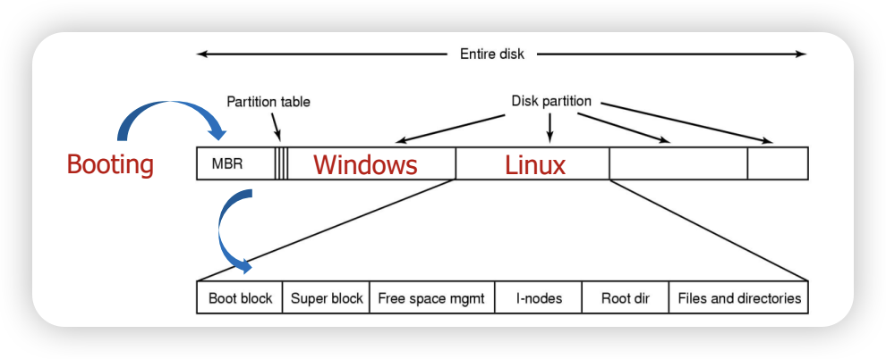

# 📖 [Booting Proccess]

## 1. **개념 요약**

리눅스 시스템의 부팅 과정과 핀토스의 부팅 과정을 비교. 이 과정에서 init 프로세스, 파일시스템 초기화 과정 설명

---

## 2. **세부 설명**

실제 리눅스 시스템의 부팅과정은 다음과 같다.

1. BIOS
2. Boot Loader
3. Kernel
4. Upstart

해당 부팅 프로세스가 완료되면 파일시스템 접근, 유저 프로그램 실행이 가능한 idle 상태로 전환된다.

### BIOS

컴퓨터에 전원이 공급되면 메인보드의 ROM에서 실행되는 firmware이다. 부팅에서 BIOS의 역할은 disk상에 MBR에 있는 boot loader를 호출하여 실행하는 것이다.



### Boot Loader

boot loader는

[개념에 대한 구체적인 설명을 작성합니다. 구현과 관련된 동작 원리, 주요 개념, 관련 용어 등을 포함합니다.]

### Kernel

### Upstart

### ref

- [Ubuntu Booting](https://wiki.ubuntu.com/Booting)

---

## 3. **관련 코드**

[이 개념과 관련된 코드 위치나 구현 방법을 설명합니다.]

- 파일 위치: `src/threads/[파일명]`
- 주요 함수:
  - `function_name()`: [함수의 역할 및 간단한 설명]
  - `function_name_2()`: [함수의 역할 및 간단한 설명]

예:

```c
/* threads/thread.c */
/* 스레드를 초기화하는 함수 */
void initialize_thread(struct thread *t, const char *name, int priority) {
    ASSERT(t != NULL);
    ASSERT(name != NULL);
    t->priority = priority;
    /* Additional initialization code here */
}
```

---

## 4. **Pintos에서의 역할**

[해당 개념이 Pintos에서 어떻게 사용되고, 구현 시 어떤 부분에서 중요한 역할을 하는지 작성합니다.]

예:

- **스레드 관리**:
  - 스레드는 Pintos에서 기본 실행 단위로, CPU 스케줄링 및 동기화의 주요 대상입니다.
  - 스레드의 상태(ready, running, blocked)는 CPU 스케줄링에 영향을 줍니다.

---

## 5. **이해를 돕는 예제**

[개념을 이해하는 데 도움이 되는 간단한 코드 예제나 시나리오를 작성합니다.]

예:

```c
/* 스레드 생성과 실행 */
struct thread *t = thread_create("worker", PRI_DEFAULT, worker_function, NULL);
/* 생성된 스레드 실행 */
thread_unblock(t);
```

---

## 6. **주요 구현 단계**

[이 개념을 구현하기 위해 필요한 단계 및 접근 방식을 나열합니다.]

1. [단계 1: 설명]
2. [단계 2: 설명]
3. [단계 3: 설명]

---

## 7. **관련 개념**

[이 개념과 관련된 다른 개념이나 구현 요소를 링크하거나 간단히 설명합니다.]

- [관련 개념 1]
- [관련 개념 2]

예:

- **스케줄링(Scheduling)**: 스레드의 실행 순서를 결정하는 알고리즘. 기본 알고리즘은 `priority scheduling`입니다.

---

## 8. **참고 자료**

[팀원들이 더 깊이 이해할 수 있도록 참고할 자료(문서, 링크 등)를 제공하세요.]

- [Pintos 공식 문서](http://web.stanford.edu/class/cs140/projects/pintos/pintos_1.html)
- [Operating Systems: Three Easy Pieces](https://pages.cs.wisc.edu/~remzi/OSTEP/)

---
